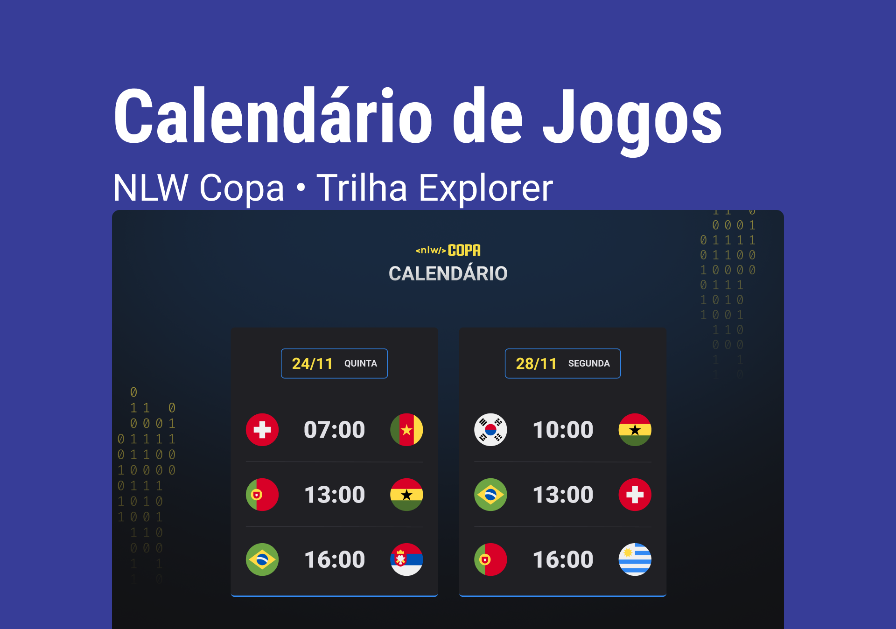

<h1>NLW - Calendário Copa 2022 Trilha Explorer</h1>

Evento exclusivo e gratuito, promovido pela Rocketseat para ensino de tecnologias WEB.

  

## :writing_hand: Author: 
- Nicolas Loffi Kaminski

## :rocket: Tecnologias:

Esse projeto foi desenvolvido com  as seguintes tecnologias:

- HTML e CSS
- JavaScript
- Git e GitHub

## :art: Projeto:
 O Calendário da Copa mostra os jogos da copa de 2022.

## Layout:
 Obtenha o layout do projeto atraves [DESSE LINK](https://www.figma.com/community/file/1169028052212317700). Necessita ter conta no Figma.